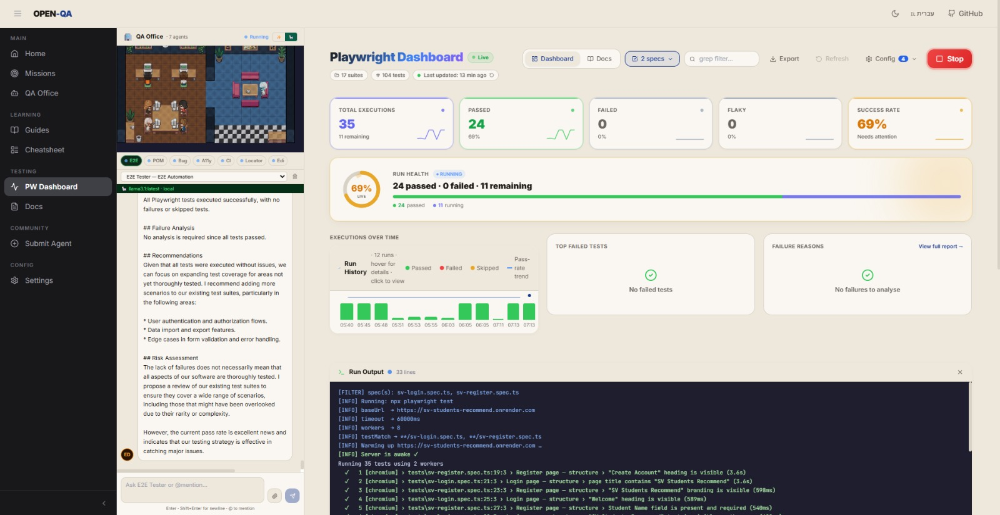
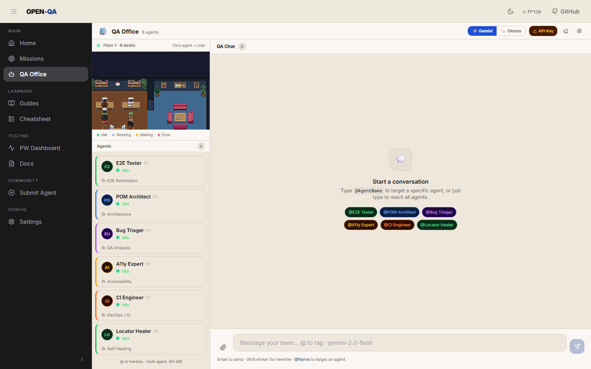
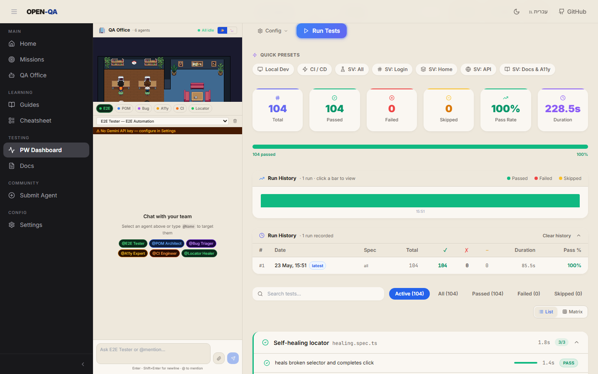
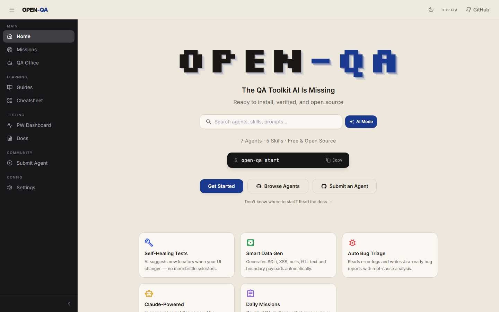
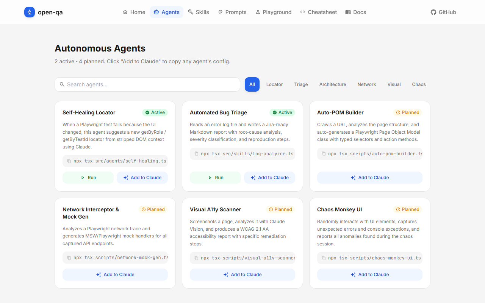

<div align="center">

# 🏢 Open-QA

**An open-source, multi-agent AI framework for Playwright test automation — featuring a 2D pixel-art office, live SSE telemetry, and Gemini / Ollama LLM routing.**

[](LICENSE)
[](https://www.typescriptlang.org)
[](https://react.dev)
[](https://playwright.dev)
[](https://vitejs.dev)
[](https://github.com/MyNameIsEdi/open-qa/actions/workflows/ci.yml)

<br/>



</div>

---

## What is Open-QA?

Open-QA is a **multi-agent AI workspace** where specialist AI agents collaborate to write, run, debug, and heal your Playwright test suite — all inside a real-time animated pixel-art office.

Type a request in the chat. **Edi M**, the Team Manager, analyses your intent and delegates to the right specialist automatically. Meanwhile the **Playwright Dashboard** streams live test output, and when a run finishes Edi M delivers a structured AI post-mortem with root-cause analysis and ready-to-paste fix code.

---

## ✨ Features

|      | Feature                           | Description                                                                                                                                                                                                                                                                                                                                                                                                                                                                                                                           |
| ---- | --------------------------------- | ------------------------------------------------------------------------------------------------------------------------------------------------------------------------------------------------------------------------------------------------------------------------------------------------------------------------------------------------------------------------------------------------------------------------------------------------------------------------------------------------------------------------------------- |
| 🏢   | **2D Pixel-Art Office**           | 7 specialist agents at animated desks — agents walk to their desk and type live while responding to chat, celebrate with checkmark bubbles on passing runs, show red ✗ bubbles on failures, and display handoff bubbles when passing work between agents in multi-turn conversations                                                                                                                                                                                                                                                  |
| 🤖   | **Edi M — Team Manager**          | Orchestrator agent that analyses your request and routes it to the right specialist                                                                                                                                                                                                                                                                                                                                                                                                                                                   |
| 🤝   | **Multi-Agent Collaboration**     | Tag two or more specialists (or @Edi M) and they iterate: primary drafts → critic reviews → primary refines → manager delivers the polished synthesis. Each turn streams into its own chat bubble with a role pill (primary / critic / synthesis). Chat history and image attachments are forwarded to the initial primary turn so vision prompts and follow-up context are preserved across collaborative rounds                                                                                                                     |
| ✨🦙 | **Gemini + Ollama**               | Switch between cloud Gemini and fully-local Ollama models with a single click — no restart required                                                                                                                                                                                                                                                                                                                                                                                                                                   |
| 🎭   | **Playwright Dashboard**          | Run your test suite, stream live terminal output, and view pass/fail telemetry in real time. Five KPI cards (Total Executions, Passed, Failed, Flaky, Success Rate) each show a sparkline from the last 8 runs and a trend delta. A three-panel insights row surfaces Executions Over Time, Top Failed Tests, and a Failure Reasons donut chart (UI Text Change / Element Not Found / Timeout / Other). Cards pulse live during a run, updating counts from the SSE stdout stream. Every run also lands an Edi M post-mortem in chat. |
| 🧠   | **Post-Run AI Summaries**         | After a test run Edi M reads the JSON results, classifies each failure (Timeout / Assertion / Locator / Network), and streams a structured executive summary with TypeScript fix snippets                                                                                                                                                                                                                                                                                                                                             |
| 📜   | **Persistent Run History + Logs** | Each run is archived in a `better-sqlite3` database (`test-results/runs.db`) with its full stdout — click any past run in the history table to replay results AND the full original log (no line-count truncation)                                                                                                                                                                                                                                                                                                                    |
| 🔧   | **Self-Healing Locators**         | Broken selectors are ranked by resilience: `getByTestId` → `getByRole` → `getByLabel` → CSS/XPath with confidence scores and caveats                                                                                                                                                                                                                                                                                                                                                                                                  |
| 🔬   | **6 CLI Agents**                  | Standalone Node.js agents: Self-Healing, Auto-POM, Bug Triage, Visual Regression, A11y Scanner, Data Generator                                                                                                                                                                                                                                                                                                                                                                                                                        |
| 📚   | **Built-in QA Course**            | 12-chapter automation curriculum with animated, interactive lessons built directly into the UI                                                                                                                                                                                                                                                                                                                                                                                                                                        |

---

## 🏗️ Architecture

```
┌──────────────────────────────────────────────────────────────────────┐
│  Browser  ·  React 18 + Vite 6  (port 5173)                         │
│                                                                      │
│  User types in chat                                                  │
│       │                                                              │
│       ▼                                                              │
│  ┌──────────┐  @-mention / route  ┌─────────────────────────────┐   │
│  │  Edi M   │ ──────────────────► │  Specialist Agent           │   │
│  │ Manager  │                     │  E2E Tester · POM Architect  │   │
│  └──────────┘                     │  Bug Triager · A11y Expert   │   │
│                                   │  CI Engineer · Locator Healer│   │
│                                   └────────────────┬────────────┘   │
│                                      SSE stream ◄──┘                │
└──────────────────────────────────────────────────────────────────────┘
                           │  POST /api/qa-agent
                           ▼
┌──────────────────────────────────────────────────────────────────────┐
│  Express  (port 3001)                                                │
│                                                                      │
│  /api/qa-agent           →  Gemini API  or  Ollama (local)          │
│                             streams token chunks back via SSE        │
│                                                                      │
│  /api/run-dynamic-test                                               │
│    Phase 1 → spawn  node @playwright/test/cli.js  →  stream stdout  │
│    Phase 2 → read   pw-results.json      →  Edi M AI summary        │
│              classify failures  →  stream summary_chunk events       │
└──────────────────────────────────────────────────────────────────────┘
```

---

## 🚀 Quick Start

### Prerequisites

- **Node.js 20+**
- **npm 10+**
- A [Google Gemini API key](https://aistudio.google.com/app/apikey) **or** [Ollama](https://ollama.ai) running locally

### 1. Clone & install

```bash
git clone https://github.com/MyNameIsEdi/open-qa.git
cd open-qa
npm install
cd ui && npm install && cd ..
```

### 2. Install Playwright browsers

```bash
npx playwright install --with-deps chromium
```

### 3. Configure your LLM

**Option A — Gemini (cloud):**

```bash
cp .env.example .env
# Edit .env and paste your GEMINI_API_KEY
```

**Option B — Ollama (fully local, no key needed):**

```bash
# Install Ollama from https://ollama.ai, then:
ollama pull qwen2.5-coder   # or llama3.2, codellama, mistral, etc.
# No .env change needed — switch to Ollama in the app Settings panel
```

### 4. Run the app

```bash
npm run dev
```

Opens at **http://localhost:5173** — the Express API runs on **http://localhost:3001**.

---

## 🔀 Switching LLM Providers

The provider toggle is built into the UI — no server restart needed.

1. Open the **QA Office** page (`/office`)
2. Click **⚙ Settings** in the top bar, or use the **✨ Gemini / 🦙 Ollama** inline toggle in the chat header
3. For Ollama: set the base URL (`http://localhost:11434`) and model name, then save

Your choice is persisted to `localStorage` — it survives page refreshes.

---

## 🗺️ Project Structure

```
open-qa/
├── server/
│   └── index.ts              # Express API — /api/qa-agent, /api/run-dynamic-test, SSE
│
├── ui/
│   └── src/
│       ├── pages/            # React pages (OfficePage, PlaywrightDashboard, …)
│       ├── components/       # Shared UI components + animated lesson components
│       ├── context/          # SettingsContext — global agent config + chat state
│       ├── office/           # Pixel-art office engine (game loop, renderer, sprites)
│       └── App.tsx           # Router + layout shell
│
├── src/
│   ├── agents/               # Standalone CLI agents
│   │   ├── self-healing/     # Self-healing locator agent
│   │   ├── auto-pom/         # Page Object Model generator
│   │   ├── visual-regression/# Pixel-diff visual regression
│   │   ├── visual-a11y/      # WCAG 2.1 AA accessibility scanner
│   │   └── explore/          # URL crawler / QA audit reporter
│   ├── skills/               # Reusable skill modules
│   │   ├── data-gen/         # Edge-case test data generator
│   │   └── log-analyzer/     # Automated bug triage
│   └── core/
│       └── llm-client.ts     # Anthropic SDK wrapper (CLI agents)
│
├── tests/                    # Playwright E2E test specs
├── examples/                 # Runnable workflow examples
└── docs/                     # Additional documentation
```

---

## 🔬 CLI Agents

The six standalone agents in `src/agents/` run independently from the UI:

| Command                         | Agent             | What it does                                                            |
| ------------------------------- | ----------------- | ----------------------------------------------------------------------- |
| `npm run heal`                  | Self-Healing      | Recovers broken Playwright selectors — outputs ranked repair candidates |
| `npm run run:auto-pom`          | Auto-POM          | Generates a typed Page Object Model class from a live URL               |
| `npm run run:bugreport`         | Bug Triage        | Turns raw error logs into a structured P0–P3 Jira-ready bug report      |
| `npm run run:visual-regression` | Visual Regression | Compares screenshots and reports pixel-level diffs                      |
| `npm run run:visual-a11y`       | A11y Scanner      | Audits a URL for WCAG 2.1 AA violations with fix recommendations        |
| `npm run run:datagen`           | Data Generator    | Creates edge-case payloads for API fuzzing and boundary testing         |

All agents run in **deterministic MOCK mode** if no `ANTHROPIC_API_KEY` is present — perfect for CI and first-time exploration.

---

## 📸 Screenshots

<table>
  <tr>
    <td align="center"><b>QA Office — Pixel-Art Map</b></td>
    <td align="center"><b>Playwright Dashboard</b></td>
  </tr>
  <tr>
    <td></td>
    <td></td>
  </tr>
  <tr>
    <td align="center"><b>Home — Agent Marketplace</b></td>
    <td align="center"><b>Autonomous Agents</b></td>
  </tr>
  <tr>
    <td></td>
    <td></td>
  </tr>
</table>

---

## 🧪 Running Tests

```bash
# Run the full Playwright suite (headless)
npm test

# Run with the HTML reporter open
npx playwright test --reporter=html

# Type-check everything
npm run typecheck          # server + root
cd ui && npx tsc --noEmit  # UI
```

---

## 🤝 Contributing

Contributions are welcome! Please read [CONTRIBUTING.md](CONTRIBUTING.md) before opening a pull request.

Key guidelines:

- All PRs must pass `npm run typecheck` and `npm run lint`
- Follow the existing TypeScript strict-mode patterns
- Agent additions go in `src/agents/<name>/index.ts`
- UI changes live in `ui/src/`

See [docs/INTEGRATION_TESTING.md](docs/INTEGRATION_TESTING.md) for patterns on combining multiple agents into workflows.

---

## 📄 License

MIT © [Open-QA Contributors](LICENSE)

---

<div align="center">

Built with ❤️ using React · Vite · Express · Playwright · Gemini · Ollama

</div>
