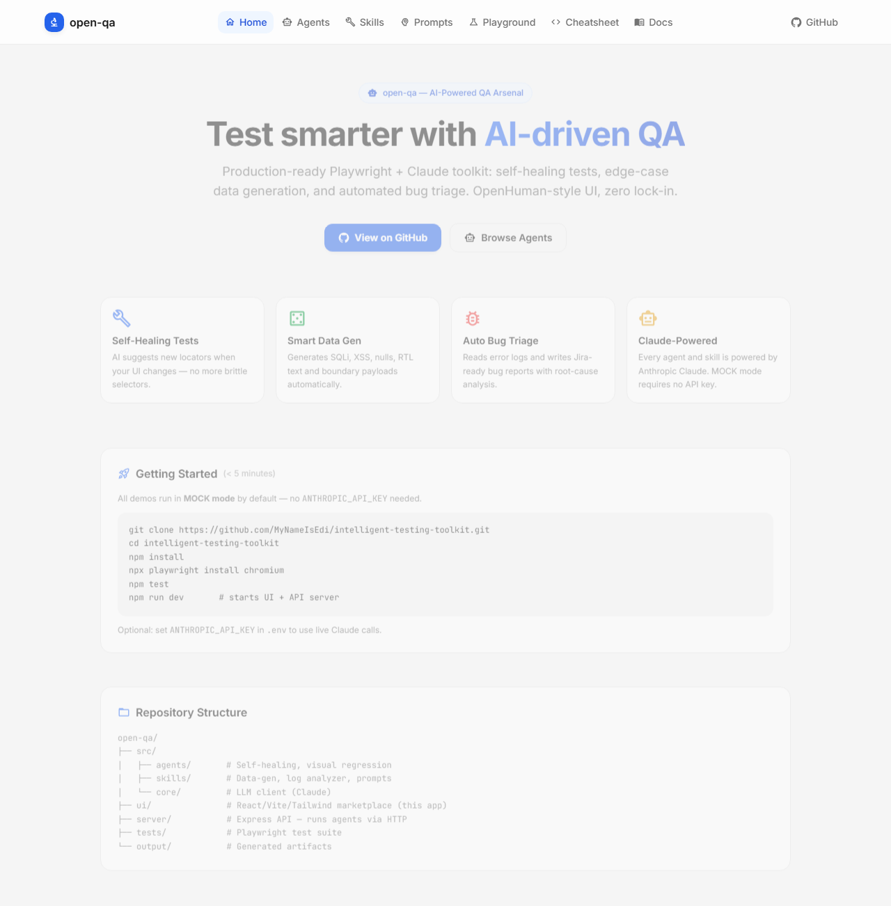

<div align="center">

# open-qa — AI-Powered QA Arsenal

**Production-ready Playwright + Claude toolkit with a React marketplace UI**

[](https://anthropic.com)
[](https://react.dev)
[](https://playwright.dev)
[](https://typescriptlang.org)
[](LICENSE)



</div>

---

## What is open-qa?

open-qa combines a Node.js AI agent core (self-healing tests, data generation, bug triage) with a React/Vite/Tailwind marketplace UI. Every agent and skill runs with **no API key needed** in MOCK mode — swap in your `ANTHROPIC_API_KEY` to go live.

---

## Features

### Autonomous Agents


Browse and run AI agents directly from the UI. Active agents have a **▶ Run** button that executes the agent and streams output inline. All cards have **Add to Claude** to copy a complete MCP-ready JSON payload.

| Agent | Status | What it does |
|-------|--------|--------------|
| Self-Healing Locator | ✅ Active | Suggests new Playwright locators when UI changes break selectors |
| Automated Bug Triage | ✅ Active | Reads error logs → writes Jira-ready Markdown bug reports with RCA |
| Auto-POM Builder | 🔜 Planned | Crawls a URL and generates a typed Playwright Page Object Model |
| Network Interceptor & Mock Gen | 🔜 Planned | Analyzes network traces → generates MSW/Playwright mock handlers |
| Visual A11y Scanner | 🔜 Planned | Screenshots + DOM → WCAG 2.1 AA accessibility report |
| Chaos Monkey UI | 🔜 Planned | Random UI interactions → captures console errors and anomalies |

---

### Prompt Playground


Select one of 6 expert QA system prompts, paste your PRD / spec / log / test code, and hit **Run**. Responses stream word-by-word. Works in MOCK mode out of the box; set `ANTHROPIC_API_KEY` for live Claude output.

**Available prompts:**
- PRD to Test Matrix
- The Hacker QA
- PRD Analyzer (Quick)
- The BDD Master
- Strict SDET PR Reviewer
- API Contract Enforcer

---

### QA Cheatsheet


One-click copy reference for Playwright patterns, assertions, network intercepts, POM boilerplate, `playwright.config.ts` templates, and GitHub Actions CI YAML — all in collapsible sections.

---

## Getting Started

### 1. Clone & install

```bash
git clone https://github.com/MyNameIsEdi/intelligent-testing-toolkit.git
cd intelligent-testing-toolkit
npm install
npx playwright install chromium
```

### 2. Start the full app (no API key needed)

```bash
npm run dev
```

Opens the UI at **http://localhost:5174** and starts the API server on port 3001.  
All agents and the playground run in **MOCK mode** by default.

### 3. Run the test suite

```bash
npm test          # Playwright end-to-end specs
npm run typecheck # TypeScript strict check
```

### 4. Enable live Claude (optional)

```bash
cp .env.example .env
# Edit .env and add: ANTHROPIC_API_KEY=sk-ant-...
npm run dev
```

---

## CLI Scripts

Run agents directly from the terminal:

```bash
npm run run:healing    # Self-healing locator agent
npm run run:datagen    # Smart edge-case data generator
npm run run:bugreport  # Automated bug triage → output/AI_BUG_REPORT.md
```

---

## Architecture

```
open-qa/
├── src/                    # Core AI logic (Node.js / TypeScript)
│   ├── agents/             # self-healing.ts, visual-regression.ts
│   ├── skills/             # generate-test-data.ts, log-analyzer.ts, prompts/
│   └── core/               # llm-client.ts (Anthropic SDK + MOCK mode)
├── ui/                     # React 18 + Vite + Tailwind marketplace
│   └── src/
│       ├── components/     # Navbar, AgentCard, SkillCard, PromptCard, RunOutput, CodeSnippet
│       └── pages/          # Home, Agents, Skills, Prompts, Playground, Cheatsheet, Docs
├── server/                 # Express 4 API (port 3001)
│   └── index.ts            # /api/agents, /api/skills, /api/run/:id, /api/playground
├── tests/                  # Playwright test suite
└── output/                 # Generated artifacts (bug reports, test data)
```

### Tech stack

| Layer | Technology |
|-------|------------|
| AI | Anthropic Claude (`claude-3-5-sonnet-20241022`) |
| UI | React 18 · Vite 6 · Tailwind CSS 3 · Material UI icons |
| Server | Express 4 · CORS · SSE streaming |
| Testing | Playwright Test |
| Language | TypeScript (strict) |

---

## Add to Claude

Every agent and skill card copies a complete tool payload for Claude Desktop or the Claude API:

```json
{
  "name": "Self-Healing Locator",
  "system_prompt": "You are a senior Playwright engineer...",
  "tool_schema": {
    "name": "self_healing_locator",
    "input_schema": {
      "type": "object",
      "properties": {
        "failed_locator": { "type": "string" },
        "dom_snapshot": { "type": "string" }
      }
    }
  },
  "run_command": "npx tsx src/agents/self-healing.ts"
}
```

---

## Roadmap

- [ ] Native MCP server (`npx open-qa mcp-server`)
- [ ] Auto-POM Builder
- [ ] Visual A11y Scanner (Claude Vision)
- [ ] GraphQL Fuzzer
- [ ] K6 Load Profile Generator
- [ ] JWT Attack Suite
- [ ] GitHub Pages live demo

---

> *"Automate the routine, use AI for the unpredictable."*
