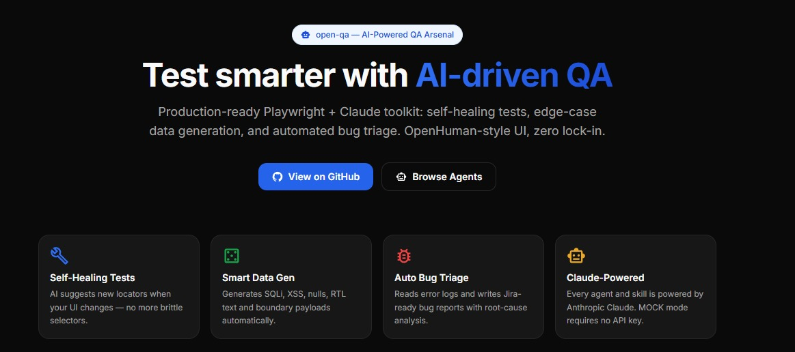

<div align="center">

# OPEN-QA — The QA Toolkit AI Is Missing

**Production-ready Playwright + Claude toolkit with a React marketplace UI**

[](https://anthropic.com)
[](https://react.dev)
[](https://playwright.dev)
[](https://typescriptlang.org)
[](LICENSE)
[](https://mynameisedi.github.io/intelligent-testing-toolkit/#/)

🚀 **[Try the Live Demo Here](https://mynameisedi.github.io/intelligent-testing-toolkit/#/)**




</div>

---

## What is open-qa?

open-qa combines a Node.js AI agent core (self-healing tests, data generation, bug triage, accessibility scanning, visual regression, POM generation) with a React/Vite/Tailwind marketplace UI. Every agent and skill runs with **no API key needed** in MOCK mode — swap in your `ANTHROPIC_API_KEY` to go live.

---

## Features

### Autonomous Agents


Browse and run AI agents directly from the UI. Active agents have a **▶ Run** button that executes the agent and streams output inline.

| Agent | Status | What it does |
|-------|--------|--------------|
| Self-Healing Locator | ✅ Active | Suggests new Playwright locators when UI changes break selectors |
| Automated Bug Triage | ✅ Active | Reads error logs → writes Jira-ready Markdown bug reports with RCA |
| Auto-POM Builder | ✅ Active | Generates typed Playwright Page Object Model classes from DOM HTML |
| Visual Regression Agent | ✅ Active | Compares baseline screenshots → quantifies pixel diff → severity report |
| Visual A11y Scanner | ✅ Active | DOM analysis → WCAG 2.1 AA violations with element-level fix recommendations |
| Network Interceptor & Mock Gen | 🔜 Planned | Analyzes network traces → generates MSW/Playwright mock handlers |
| Chaos Monkey UI | 🔜 Planned | Random UI interactions → captures console errors and anomalies |

---

### Prompt Playground


Select one of 6 expert QA system prompts, paste your PRD / spec / log / test code, and hit **Run**. Responses stream word-by-word. Works in MOCK mode out of the box.

**Available prompts:**
- PRD to Test Matrix
- The Hacker QA
- PRD Analyzer (Quick)
- The BDD Master
- Strict SDET PR Reviewer
- API Contract Enforcer

---

### Test Generator

Paste a user story or acceptance criteria and get a complete, production-ready Playwright `.spec.ts` file back — with options for Page Object Model output and authenticated tests. Includes a one-click download button.

---

### QA Automation Guides

**12 hands-on chapters** built into the app — a complete course from zero to AI-powered QA:

| # | Chapter | Level | Time |
|---|---------|-------|------|
| 1 | Intro to QA Automation | Beginner | 5 min |
| 2 | Setting Up Playwright | Beginner | 10 min |
| 3 | Writing Your First Test | Beginner | 10 min |
| 4 | Locator Strategies | Beginner | 15 min |
| 5 | Assertions & Expect API | Intermediate | 10 min |
| 6 | Page Object Model (POM) | Intermediate | 15 min |
| 7 | API Testing with Playwright | Intermediate | 15 min |
| 8 | API Testing with Postman | Intermediate | 10 min |
| 9 | SQL & Database Testing | Intermediate | 15 min |
| 10 | Visual & Accessibility Testing | Intermediate | 10 min |
| 11 | CI/CD with GitHub Actions | Advanced | 15 min |
| 12 | AI-Powered QA with Claude | Advanced | 10 min |

Each chapter includes narrative explanation, key concepts, copy-ready code snippets, and a **Mark as complete** toggle that persists progress in localStorage.

---

### Submit an Agent

Fill in a form at `/submit` — name, system prompt, category, run command — and click **Open GitHub Issue →**. The app builds a pre-filled issue with a copy-ready `AgentsPage.tsx` snippet for the maintainer.

---

### QA Cheatsheet


One-click copy reference with **10 collapsible sections** — all your go-to patterns in one place:

| Section | Contents |
|---------|----------|
| Playwright Locators | `getByRole`, `getByLabel`, chaining, filtering |
| Common Assertions | Visibility, text, URL, count matchers |
| Network Intercepts | Mock, modify, simulate errors, wait for request |
| Page Object Model | POM class template + usage in tests |
| playwright.config.ts | Base config + auth storageState setup |
| GitHub Actions CI | Single workflow + sharded parallel runs |
| API Testing | `APIRequestContext`, auth headers, schema validation |
| Accessibility Testing | axe-core, keyboard navigation, contrast checks |
| Mobile & Responsive | Viewport, device presets, touch events |
| Test Data with Faker.js | Factory pattern, seeding, fixture files |

---

## Getting Started

### 1. Clone & install

```bash
git clone [https://github.com/MyNameIsEdi/intelligent-testing-toolkit.git](https://github.com/MyNameIsEdi/intelligent-testing-toolkit.git)
cd intelligent-testing-toolkit
npm install
npx playwright install chromium

```

### 2. Start the full app (no API key needed)

```bash
npm run dev

```

Opens the UI at **http://localhost:5174** and starts the API server on port 3001.

All agents and the playground run in **MOCK mode** by default.

### 3. Run the test suite

```bash
npm test          # Playwright end-to-end specs
npm run typecheck # TypeScript strict check

```

### 4. Enable live Claude (optional)

```bash
cp .env.example .env
# Edit .env and add: ANTHROPIC_API_KEY=sk-ant-...
npm run dev

```

---

## CLI Scripts

Run agents directly from the terminal:

```bash
npm run run:healing         # Self-healing locator agent
npm run run:datagen         # Smart edge-case data generator
npm run run:bugreport       # Automated bug triage → output/AI_BUG_REPORT.md
npm run run:visual-regression  # Visual regression → output/visual-regression/
npm run run:auto-pom        # Auto-POM Builder → output/auto-pom/
npm run run:visual-a11y     # Visual A11y Scanner → output/A11Y_REPORT.md
```

---

## Architecture

```
open-qa/
├── src/                    # Core AI logic (Node.js / TypeScript)
│   ├── agents/
│   │   ├── self-healing/index.ts       # Self-Healing Locator
│   │   ├── visual-regression/index.ts  # Visual Regression Agent
│   │   ├── auto-pom/index.ts           # Auto-POM Builder
│   │   └── visual-a11y/index.ts        # Visual A11y Scanner
│   ├── skills/
│   │   ├── data-gen/index.ts           # Smart Edge-Case Data Gen
│   │   ├── data-gen/prompts.ts         # QA engineer system prompts
│   │   └── log-analyzer/index.ts       # Automated Bug Triage
│   └── core/
│       └── llm-client.ts               # Anthropic SDK wrapper (MOCK + live)
├── ui/                     # React 18 + Vite + Tailwind marketplace
│   └── src/
│       ├── components/     # Navbar, AgentCard, SkillCard, PromptCard, RunOutput, CodeSnippet
│       └── pages/          # Home, Agents, Skills, Prompts, Playground, Generate, Guides, Cheatsheet, Docs, Submit
├── server/                 # Express 4 API (port 3001)
│   └── index.ts            # /api/agents, /api/skills, /api/run/:id, /api/playground
├── tests/                  # Playwright test suite
└── output/                 # Generated artifacts (bug reports, test data, POM files)
```

### Tech stack

| Layer | Technology |
| --- | --- |
| AI | Anthropic Claude (`claude-3-5-sonnet-20241022`) |
| UI | React 18 · Vite 6 · Tailwind CSS 3 · Material UI icons |
| Server | Express 4 · CORS · SSE streaming |
| Testing | Playwright Test |
| Language | TypeScript (strict) |

---

## Add to Claude

Every agent and skill card copies a complete tool payload for Claude Desktop or the Claude API:

```json
{
  "name": "Self-Healing Locator",
  "system_prompt": "You are a senior Playwright engineer...",
  "tool_schema": {
    "name": "self_healing_locator",
    "input_schema": {
      "type": "object",
      "properties": {
        "failed_locator": { "type": "string" },
        "dom_snapshot": { "type": "string" }
      }
    }
  },
  "run_command": "npx tsx src/agents/self-healing/index.ts"
}

```

---

## Roadmap

* [ ] Native MCP server (`npx open-qa mcp-server`)
* [ ] Network Interceptor & Mock Gen
* [ ] Chaos Monkey UI
* [ ] GraphQL Fuzzer skill
* [ ] K6 Load Profile Generator skill
* [ ] JWT Attack Suite skill
* [x] [GitHub Pages live demo](https://mynameisedi.github.io/intelligent-testing-toolkit/#/)
* [x] QA Automation Guides (12-chapter course)
* [x] Submit an Agent page
* [x] Skills-IL inspired warm-palette redesign


---

> *"Automate the routine, use AI for the unpredictable."*

```

```
