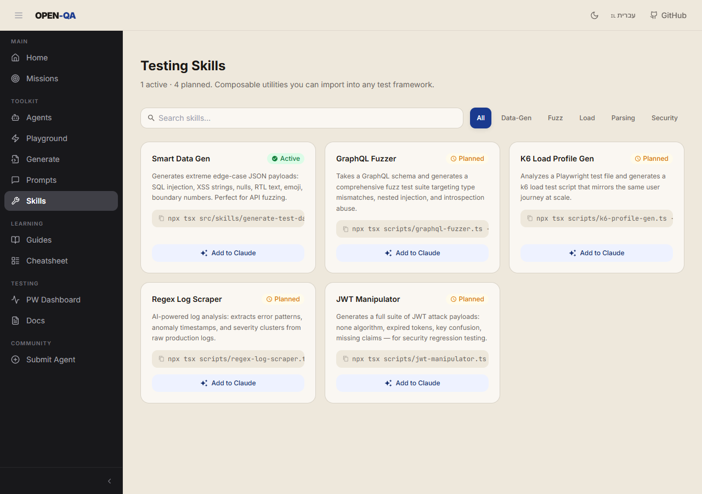
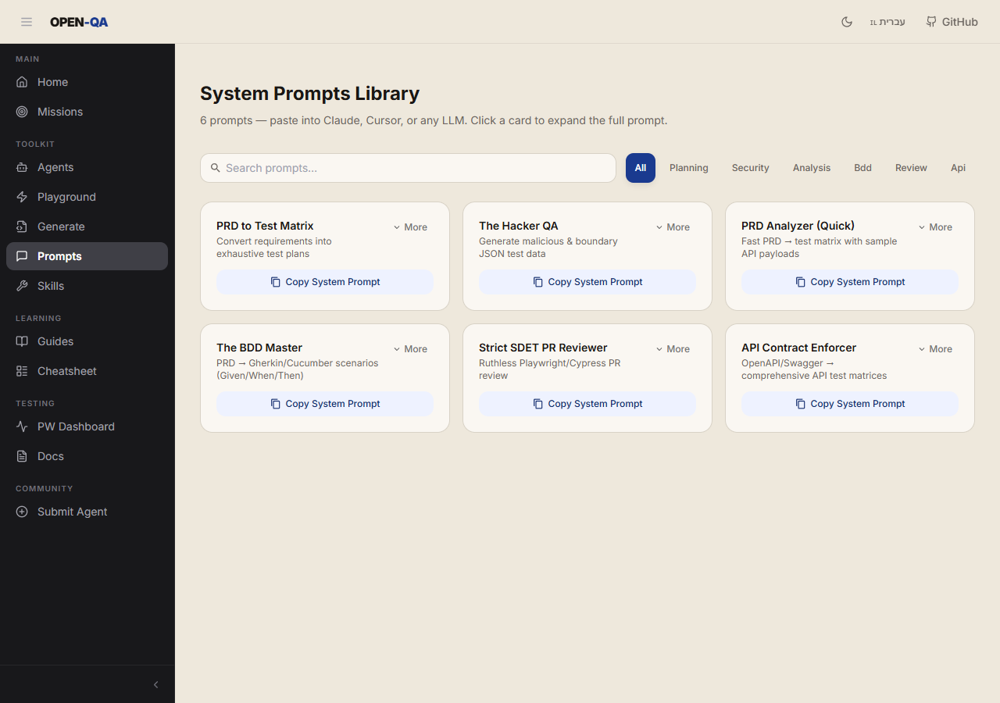
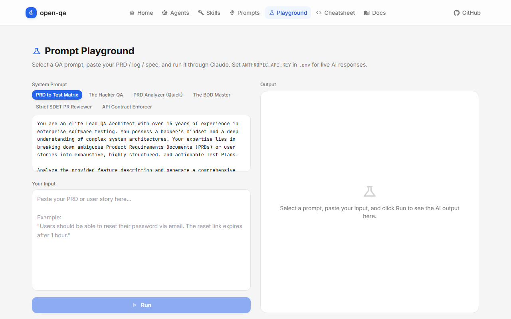
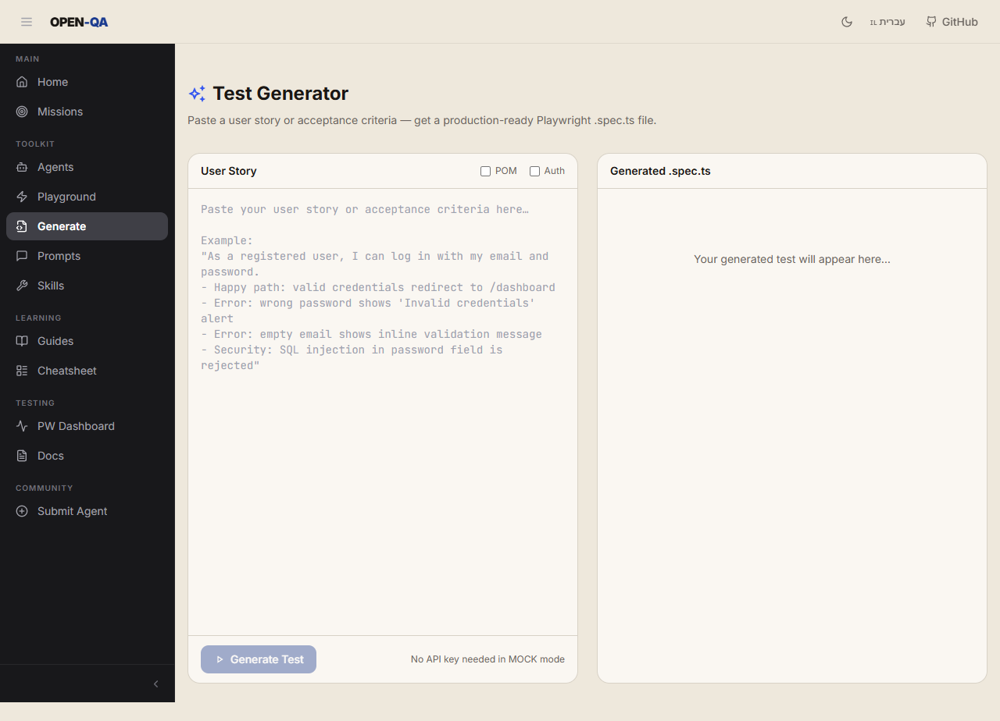
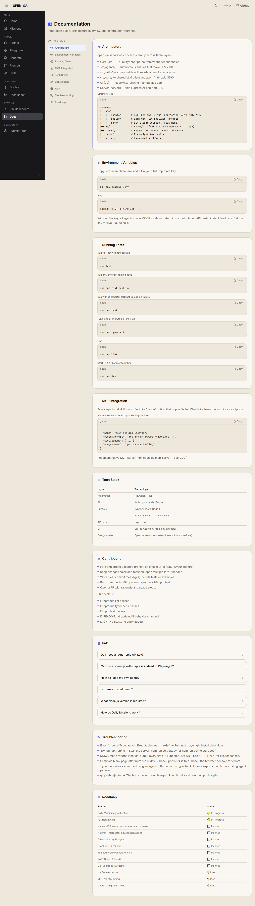
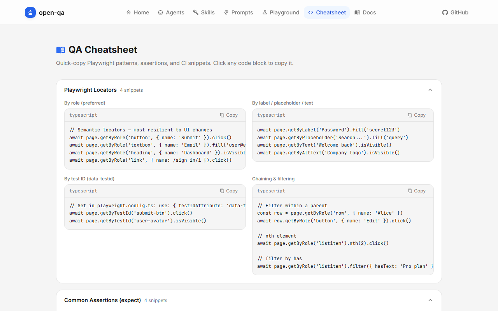

<div align="center">

# OPEN-QA — The QA Toolkit AI Is Missing

**Production-ready Playwright + Claude toolkit with a pixel-art AI office, live chat, and React marketplace UI**

[](https://anthropic.com)
[](https://react.dev)
[](https://playwright.dev)
[](https://typescriptlang.org)
[](LICENSE)
[](https://mynameisedi.github.io/open-qa/#/)

🚀 **[Try the Live Demo Here](https://mynameisedi.github.io/open-qa/#/)**


</div>

---

## What is open-qa?

open-qa combines a Node.js AI agent core (self-healing tests, data generation, bug triage, accessibility scanning, visual regression, POM generation) with a React/Vite/Tailwind marketplace UI and a **pixel-art QA Office** where six specialist AI agents live and respond to your messages in real time. Every agent and skill runs with **no API key needed** in MOCK mode — swap in your Gemini API key or point it at a local **Ollama** model to go fully live.

---

## Features

### 🏢 QA Office — Live AI Chat with Your Team


A pixel-art office where six specialist QA agents sit at their desks and answer your questions in real time. Click any agent on the canvas or `@mention` them in the chat to direct a question. Responses stream word-by-word via SSE.

| Agent | Desk | Speciality |
|-------|------|-----------|
| E2E Tester | E2E Station | Playwright tests, Page Object Models, locator best practices |
| POM Architect | Architecture | Typed POM classes from DOM snapshots |
| Bug Triager | Triage Hub | Structured bug reports: P0–P3, RCA, steps to reproduce |
| A11y Expert | A11y Lab | WCAG 2.1 AA violations with element-level fixes |
| CI Engineer | CI Pipeline | GitHub Actions pipelines, sharding, Docker, artefact upload |
| Locator Healer | Healer Lab | Self-healing broken Playwright locators — ranked candidate table |

**Chat features:**
- `@mention` autocomplete to target specific agents
- File & image attachments (paste or 📎 button)
- Inline Gemini ↔ Ollama provider toggle — switch models without leaving the page
- Shared conversation history across all pages (persisted in localStorage)
- Markdown rendering with copy-ready code blocks

---

### 📊 Playwright Dashboard — Run Tests + Office in One View


Run your Playwright suite, watch live output stream in, and discuss failures with the AI team — all in the same panel. The integrated QA Office panel sits alongside the test runner:

- **Live test output** streams line-by-line as tests execute
- **Run History** — every run archived with pass/fail counts and duration
- **Spec filter** — select individual spec files to run
- **All 6 agents animate** when tests are running; Bug Triager + Locator Healer stay active after a run with failures
- **Full AI chat** — same @mention, file attachment, and streaming as the QA Office

---

### Autonomous Agents


Browse and run AI agents directly from the UI. Active agents have a **▶ Run** button that executes the agent and streams output inline.

| Agent | Status | What it does |
|-------|--------|--------------|
| Self-Healing Locator | ✅ Active | Suggests new Playwright locators when UI changes break selectors |
| Automated Bug Triage | ✅ Active | Reads error logs → writes Jira-ready Markdown bug reports with RCA |
| Auto-POM Builder | ✅ Active | Generates typed Playwright Page Object Model classes from DOM HTML |
| Visual Regression Agent | ✅ Active | Compares baseline screenshots → quantifies pixel diff → severity report |
| Visual A11y Scanner | ✅ Active | DOM analysis → WCAG 2.1 AA violations with element-level fix recommendations |
| Network Interceptor & Mock Gen | 🔜 Planned | Analyzes network traces → generates MSW/Playwright mock handlers |
| Chaos Monkey UI | 🔜 Planned | Random UI interactions → captures console errors and anomalies |

---

### Testing Skills



Composable QA utilities for data generation, fuzzing, load profiles, parsing, and security workflows.
Active skills can be copied directly into Claude-compatible tool payloads.

---

### System Prompts Library



Browse expert QA prompts for planning, security, analysis, BDD, review, and API contract checks.
Each card can expand the full prompt and copy it in one click.

---

### Prompt Playground



Select one of 6 expert QA system prompts, paste your PRD / spec / log / test code, and hit **Run**. Responses stream word-by-word. Works in MOCK mode out of the box.

**Available prompts:**
- PRD to Test Matrix
- The Hacker QA
- PRD Analyzer (Quick)
- The BDD Master
- Strict SDET PR Reviewer
- API Contract Enforcer

---

### Test Generator



Paste a user story or acceptance criteria and get a complete, production-ready Playwright `.spec.ts` file back — with options for Page Object Model output and authenticated tests. Includes a one-click download button.

---

### QA Automation Guides



**12 hands-on chapters** built into the app — a complete course from zero to AI-powered QA:

| # | Chapter | Level | Time |
|---|---------|-------|------|
| 1 | Intro to QA Automation | Beginner | 5 min |
| 2 | Setting Up Playwright | Beginner | 10 min |
| 3 | Writing Your First Test | Beginner | 10 min |
| 4 | Locator Strategies | Beginner | 15 min |
| 5 | Assertions & Expect API | Intermediate | 10 min |
| 6 | Page Object Model (POM) | Intermediate | 15 min |
| 7 | API Testing with Playwright | Intermediate | 15 min |
| 8 | API Testing with Postman | Intermediate | 10 min |
| 9 | SQL & Database Testing | Intermediate | 15 min |
| 10 | Visual & Accessibility Testing | Intermediate | 10 min |
| 11 | CI/CD with GitHub Actions | Advanced | 15 min |
| 12 | AI-Powered QA with Claude | Advanced | 10 min |

Each chapter includes narrative explanation, key concepts, copy-ready code snippets, and a **Mark as complete** toggle that persists progress in localStorage.

---

### Submit an Agent

Fill in a form at `/submit` — name, system prompt, category, run command — and click **Open GitHub Issue →**. The app builds a pre-filled issue with a copy-ready `AgentsPage.tsx` snippet for the maintainer.

---

### QA Cheatsheet



One-click copy reference with **10 collapsible sections** — all your go-to patterns in one place:

| Section | Contents |
|---------|----------|
| Playwright Locators | `getByRole`, `getByLabel`, chaining, filtering |
| Common Assertions | Visibility, text, URL, count matchers |
| Network Intercepts | Mock, modify, simulate errors, wait for request |
| Page Object Model | POM class template + usage in tests |
| playwright.config.ts | Base config + auth storageState setup |
| GitHub Actions CI | Single workflow + sharded parallel runs |
| API Testing | `APIRequestContext`, auth headers, schema validation |
| Accessibility Testing | axe-core, keyboard navigation, contrast checks |
| Mobile & Responsive | Viewport, device presets, touch events |
| Test Data with Faker.js | Factory pattern, seeding, fixture files |

---

## Getting Started

### 1. Clone & install

```bash
git clone https://github.com/MyNameIsEdi/open-qa.git
cd open-qa
npm install
npx playwright install chromium
```

### 2. Start the full app (no API key needed)

```bash
npm run dev
```

Opens the UI at **http://localhost:5174** and starts the API server on port 3001.

All agents and the playground run in **MOCK mode** by default.

### 3. Run the test suite

```bash
npm test          # Playwright end-to-end specs
npm run typecheck # TypeScript strict check
```

### 4a. Enable live Gemini (optional)

Go to **Settings** in the app, enter your Gemini API key, and select a model. Or set it in the QA Office chat header directly.

```bash
# Or set via environment variable:
GEMINI_API_KEY=your-key npm run dev
```

### 4b. Enable local Ollama (optional)

```bash
# Install Ollama: https://ollama.com
ollama pull llama3.2   # or mistral, codellama, etc.
ollama serve           # starts on http://localhost:11434
```

Then open the app → **Settings** → switch provider to **Ollama** and choose your model. Or use the **✨ / 🦙** toggle in the QA Office chat header for instant switching.

---

## CLI

```bash
# Run agents directly from the terminal:
npm run run:healing            # Self-healing locator agent
npm run run:datagen            # Smart edge-case data generator
npm run run:bugreport          # Automated bug triage → output/AI_BUG_REPORT.md
npm run run:visual-regression  # Visual regression → output/visual-regression/
npm run run:auto-pom           # Auto-POM Builder → output/auto-pom/
npm run run:visual-a11y        # Visual A11y Scanner → output/A11Y_REPORT.md

# Global CLI (install once):
npm install -g .
open-qa start        # start the full app
open-qa explore <url> # crawl a URL and generate a QA report
open-qa heal         # run the self-healing locator agent
open-qa help         # list all commands
```

---

## Project Structure

```
open-qa/
├── src/                        # Core AI logic (Node.js / TypeScript)
│   ├── agents/
│   │   ├── self-healing/       # Self-Healing Locator
│   │   ├── visual-regression/  # Visual Regression Agent
│   │   ├── auto-pom/           # Auto-POM Builder
│   │   └── visual-a11y/        # Visual A11y Scanner
│   ├── skills/
│   │   ├── data-gen/           # Smart Edge-Case Data Gen
│   │   └── log-analyzer/       # Automated Bug Triage
│   └── core/
│       └── llm-client.ts       # Anthropic SDK wrapper (MOCK + live)
├── ui/                         # React 18 + Vite + Tailwind marketplace
│   └── src/
│       ├── components/         # Navbar, AgentCard, SkillCard, Sidebar…
│       ├── context/            # SettingsContext (agents, chat, provider)
│       ├── office/             # Pixel-art engine (game loop, renderer, sprites)
│       └── pages/
│           ├── OfficePage.tsx          # QA Office — canvas + 6 agents + chat
│           ├── PlaywrightDashboard.tsx # Test runner + integrated office chat
│           ├── SettingsPage.tsx        # API keys, Gemini/Ollama config
│           └── …                       # Agents, Skills, Prompts, Playground…
├── server/                     # Express 4 API (port 3001)
│   └── index.ts                # /api/qa-agent (SSE), /api/playwright/run, …
├── tests/                      # Playwright test suite
├── docs/                       # HTML documentation site
├── examples/                   # Usage examples & skill template
├── assets/
│   └── screenshots/            # README & documentation images
├── output/                     # Generated artifacts from agent runs
└── test-results/               # Playwright run results & archived runs
```

### Tech stack

| Layer | Technology |
| --- | --- |
| AI | Google Gemini (`gemini-2.0-flash`) · Ollama (any local model) |
| Office | Pixel-art canvas engine — sprites, game loop, SSE streaming |
| UI | React 18 · Vite 6 · Tailwind CSS 3 |
| Server | Express 4 · CORS · SSE streaming |
| Testing | Playwright Test |
| Language | TypeScript (strict) |

---

## Add to Claude

Every agent and skill card copies a complete tool payload for Claude Desktop or the Claude API:

```json
{
  "name": "Self-Healing Locator",
  "system_prompt": "You are a senior Playwright engineer...",
  "tool_schema": {
    "name": "self_healing_locator",
    "input_schema": {
      "type": "object",
      "properties": {
        "failed_locator": { "type": "string" },
        "dom_snapshot": { "type": "string" }
      }
    }
  },
  "run_command": "npx tsx src/agents/self-healing/index.ts"
}
```

---

## Roadmap

* [ ] Native MCP server (`npx open-qa mcp-server`)
* [ ] Network Interceptor & Mock Gen
* [ ] Chaos Monkey UI
* [ ] GraphQL Fuzzer skill
* [ ] K6 Load Profile Generator skill
* [ ] JWT Attack Suite skill
* [x] [GitHub Pages live demo](https://mynameisedi.github.io/open-qa/#/)
* [x] QA Automation Guides (12-chapter course)
* [x] Submit an Agent page
* [x] Skills-IL inspired warm-palette redesign
* [x] **QA Office** — pixel-art office with 6 live AI agents + chat
* [x] **Playwright Dashboard** — integrated test runner + office chat
* [x] **Ollama support** — run agents against any local LLM
* [x] **Locator Healer agent** — self-healing ranked locator table
* [x] **Global CLI** (`open-qa start`, `explore`, `heal`)

---

> *"Automate the routine, use AI for the unpredictable."*
